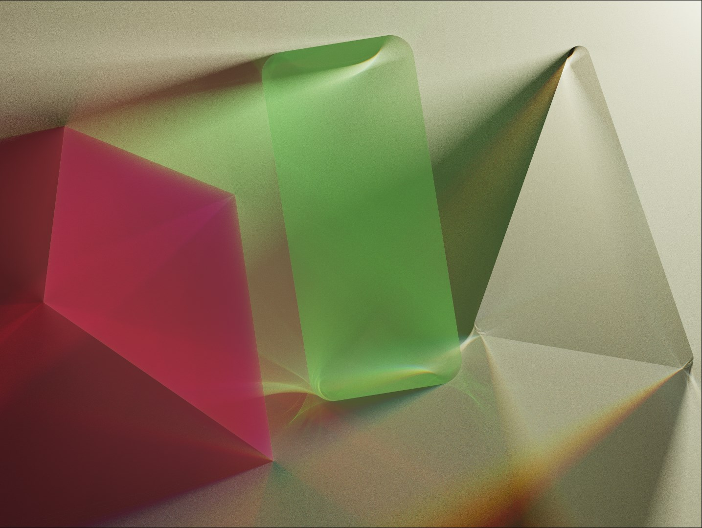
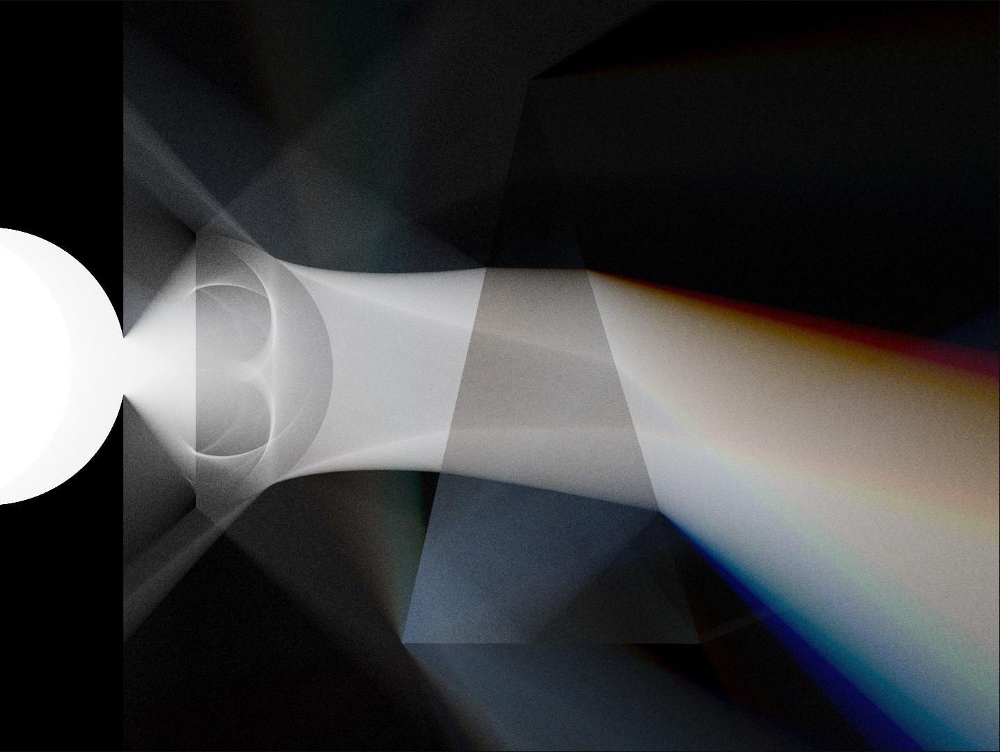
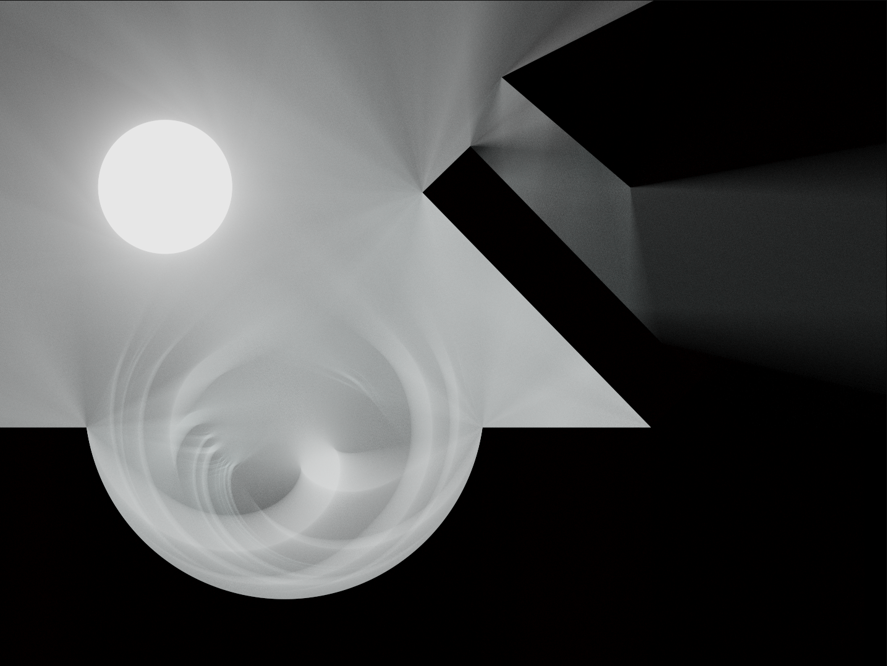
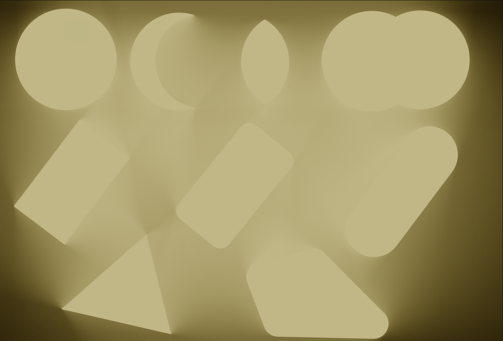

# Light 2D
Attempt at 2D SDF raymarching inspired by <https://github.com/miloyip/light2d>.

## Description

Software stores and allows user to edit a scene - set of materials, objects and rendering settings, which are taken as input to produce an image on a screen.

Scene object represents an SDF (signed distance function) of a shape plus a reference to a material or an operation over shapes (Union, Intersecion, etc). 

Material consists of emission, refraction, absorption coefficients, which control light ray interaction with a shape using this material.

Scene is rendered into glsl function (x, y) -> (signed distance, material), which is injected into raymarching fragment shader and compiled during runtime.

Shader is invoked over a grid of pixels and for each pixel computes amount of light that reaches that pixel.

For perfomance reasons rendering of an image is spread over multiple frames (1024 * 3 * image_tiles_per_frame). The more user waits without changing scene, the less noise remains in the produced image.

## Images

## Used libraries and tools
* [glm](https://github.com/g-truc/glm)
* [imgui](https://github.com/ocornut/imgui)
* [SDL2](https://www.libsdl.org/)
* [Glad2](https://github.com/Dav1dde/glad)
* [Fmt](https://github.com/fmtlib/fmt)
* [Emscripten](https://emscripten.org/)

## Useful resources
* <https://github.com/miloyip/light2d>
* [Reflections and Refractions in Ray Tracing](https://graphics.stanford.edu/courses/cs148-10-summer/docs/2006--degreve--reflection_refraction.pdf)
* <https://iquilezles.org/articles/>
* [Gamma Correction - Learn OpengGL](https://learnopengl.com/Advanced-Lighting/Gamma-Correction)
* <https://64.github.io/tonemapping/>